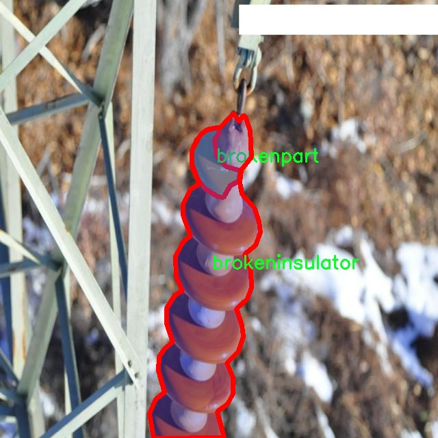

# 输电线路绝缘子缺陷分割系统源码＆数据集分享
 [yolov8-seg＆yolov8-seg-C2f-MSBlock等50+全套改进创新点发刊_一键训练教程_Web前端展示]

### 1.研究背景与意义

项目参考[ILSVRC ImageNet Large Scale Visual Recognition Challenge](https://gitee.com/YOLOv8_YOLOv11_Segmentation_Studio/projects)

项目来源[AAAI Global Al lnnovation Contest](https://kdocs.cn/l/cszuIiCKVNis)

研究背景与意义

随着电力需求的不断增长，输电线路的安全性和可靠性显得尤为重要。输电线路中的绝缘子作为关键组件，其健康状态直接影响到电力系统的稳定运行。绝缘子的缺陷，如破损、老化和其他形式的损伤，可能导致电力传输的中断，甚至引发更为严重的安全事故。因此，及时、准确地检测和分割输电线路绝缘子的缺陷，成为了电力行业亟待解决的问题。

近年来，深度学习技术的迅猛发展为图像处理和计算机视觉领域带来了新的机遇。尤其是基于卷积神经网络（CNN）的目标检测和分割技术，已经在多个领域取得了显著的成果。YOLO（You Only Look Once）系列模型因其高效的实时检测能力，广泛应用于各种目标检测任务中。YOLOv8作为该系列的最新版本，具备更强的特征提取能力和更快的推理速度，适合于处理复杂的图像分割任务。因此，基于改进YOLOv8的输电线路绝缘子缺陷分割系统的研究具有重要的现实意义。

本研究所使用的数据集包含1100张图像，涵盖了四个类别：破损绝缘子（brokeninsulator）、破损部件（brokenpart）、缺陷（defect）和绝缘子（insulator）。这些类别的划分不仅有助于细化缺陷检测的标准，还为后续的模型训练提供了丰富的样本数据。通过对这些图像的分析和处理，可以实现对不同类型绝缘子缺陷的精准识别和分割，从而为电力公司提供科学的决策依据。

在实际应用中，传统的人工检测方法往往依赖于经验，容易受到主观因素的影响，且效率低下。相比之下，基于深度学习的自动化检测系统能够在短时间内处理大量图像，显著提高检测效率和准确性。此外，深度学习模型的自我学习能力使其能够不断优化，适应不同环境和条件下的检测需求。这一转变不仅提升了绝缘子缺陷检测的效率，也为电力行业的智能化发展奠定了基础。

通过本研究的实施，期望能够实现以下几个目标：首先，构建一个高效的输电线路绝缘子缺陷分割系统，能够实时、准确地识别和分割绝缘子缺陷；其次，利用改进的YOLOv8模型，提升分割精度和速度，为电力行业提供更为可靠的技术支持；最后，推动输电线路的智能监测与维护，降低因绝缘子缺陷导致的电力事故风险，保障电力系统的安全稳定运行。

综上所述，基于改进YOLOv8的输电线路绝缘子缺陷分割系统的研究，不仅具有重要的理论价值，也具备广泛的应用前景。通过深入探索深度学习在电力行业中的应用，能够为未来的智能电网建设提供有力的技术支撑，推动电力行业的数字化转型与升级。

### 2.图片演示


##### 注意：由于此博客编辑较早，上面“2.图片演示”和“3.视频演示”展示的系统图片或者视频可能为老版本，新版本在老版本的基础上升级如下：（实际效果以升级的新版本为准）

  （1）适配了YOLOV8的“目标检测”模型和“实例分割”模型，通过加载相应的权重（.pt）文件即可自适应加载模型。

  （2）支持“图片识别”、“视频识别”、“摄像头实时识别”三种识别模式。

  （3）支持“图片识别”、“视频识别”、“摄像头实时识别”三种识别结果保存导出，解决手动导出（容易卡顿出现爆内存）存在的问题，识别完自动保存结果并导出到tempDir中。

  （4）支持Web前端系统中的标题、背景图等自定义修改，后面提供修改教程。

  另外本项目提供训练的数据集和训练教程,暂不提供权重文件（best.pt）,需要您按照教程进行训练后实现图片演示和Web前端界面演示的效果。

### 3.视频演示

[3.1 视频演示](https://www.bilibili.com/video/BV1BpDPY3Efe/)

### 4.数据集信息展示

##### 4.1 本项目数据集详细数据（类别数＆类别名）

nc: 3
names: ['brokeninsulator', 'brokenpart', 'insulator']


##### 4.2 本项目数据集信息介绍

数据集信息展示

在现代电力系统中，输电线路的安全性与稳定性至关重要，而绝缘子的完好状态直接影响到电力传输的可靠性。因此，针对输电线路绝缘子缺陷的检测与分割，构建一个高效的数据集显得尤为重要。本研究所使用的数据集名为“transmission_lines_insulators”，旨在为改进YOLOv8-seg模型提供支持，以实现对输电线路绝缘子缺陷的精准分割与识别。

该数据集包含三类主要的缺陷类别，具体为“brokeninsulator”（破损绝缘子）、“brokenpart”（破损部件）和“insulator”（正常绝缘子）。这些类别的划分不仅有助于模型的训练与测试，还能为后续的缺陷分析提供重要依据。数据集中每一类的样本数量均经过精心设计，以确保模型在训练过程中能够充分学习到不同类别的特征。

“brokeninsulator”类别主要涵盖了由于外部环境因素、老化或物理损伤导致的绝缘子破损情况。这类样本的多样性体现在不同的破损程度、破损位置以及光照条件下的表现，确保模型能够在多变的实际环境中有效识别破损绝缘子。通过对这一类别的深入学习，模型将能够在实际应用中快速、准确地识别出潜在的安全隐患。

“brokenpart”类别则聚焦于绝缘子组件的破损情况，包括但不限于绝缘子连接件的松动、裂纹等。这一类别的样本同样涵盖了多种破损形式，目的是让模型能够识别出即使是微小的损伤，也可能对整体绝缘性能造成影响的情况。通过对这些细微特征的学习，模型的鲁棒性将得到显著提升，从而在实际监测中发挥更大的作用。

最后，“insulator”类别则代表了正常状态下的绝缘子样本。这一类别的样本为模型提供了一个基准，使其能够在进行缺陷检测时，与正常状态进行对比。通过对正常绝缘子的学习，模型能够更好地理解何为“正常”，从而在检测过程中更准确地识别出异常情况。

数据集“transmission_lines_insulators”的构建不仅考虑了样本的多样性与代表性，还注重了数据的标注质量。每一张图像都经过专业人员的仔细标注，确保了数据的准确性与可靠性。这一高质量的数据集为改进YOLOv8-seg模型提供了坚实的基础，使其在输电线路绝缘子缺陷分割任务中具备更高的准确率与效率。

通过对该数据集的深入分析与应用，研究者们希望能够推动输电线路绝缘子缺陷检测技术的发展，为电力行业的安全运行提供有力支持。随着技术的不断进步，未来的数据集构建将更加注重多样性与复杂性，以适应日益严峻的电力系统安全挑战。





### 5.全套项目环境部署视频教程（零基础手把手教学）

[5.1 环境部署教程链接（零基础手把手教学）](https://www.bilibili.com/video/BV1jG4Ve4E9t/?vd_source=bc9aec86d164b67a7004b996143742dc)


[5.2 安装Python虚拟环境创建和依赖库安装视频教程链接（零基础手把手教学）](https://www.bilibili.com/video/BV1nA4VeYEze/?vd_source=bc9aec86d164b67a7004b996143742dc)

### 6.手把手YOLOV8-seg训练视频教程（零基础小白有手就能学会）

[6.1 手把手YOLOV8-seg训练视频教程（零基础小白有手就能学会）](https://www.bilibili.com/video/BV1cA4VeYETe/?vd_source=bc9aec86d164b67a7004b996143742dc)


按照上面的训练视频教程链接加载项目提供的数据集，运行train.py即可开始训练



     Epoch   gpu_mem       box       obj       cls    labels  img_size
     1/200     0G   0.01576   0.01955  0.007536        22      1280: 100%|██████████| 849/849 [14:42<00:00,  1.04s/it]
               Class     Images     Labels          P          R     mAP@.5 mAP@.5:.95: 100%|██████████| 213/213 [01:14<00:00,  2.87it/s]
                 all       3395      17314      0.994      0.957      0.0957      0.0843

     Epoch   gpu_mem       box       obj       cls    labels  img_size
     2/200     0G   0.01578   0.01923  0.007006        22      1280: 100%|██████████| 849/849 [14:44<00:00,  1.04s/it]
               Class     Images     Labels          P          R     mAP@.5 mAP@.5:.95: 100%|██████████| 213/213 [01:12<00:00,  2.95it/s]
                 all       3395      17314      0.996      0.956      0.0957      0.0845

     Epoch   gpu_mem       box       obj       cls    labels  img_size
     3/200     0G   0.01561    0.0191  0.006895        27      1280: 100%|██████████| 849/849 [10:56<00:00,  1.29it/s]
               Class     Images     Labels          P          R     mAP@.5 mAP@.5:.95: 100%|███████   | 187/213 [00:52<00:00,  4.04it/s]
                 all       3395      17314      0.996      0.957      0.0957      0.0845


### 7.50+种全套YOLOV8-seg创新点代码加载调参视频教程（一键加载写好的改进模型的配置文件）

[7.1 50+种全套YOLOV8-seg创新点代码加载调参视频教程（一键加载写好的改进模型的配置文件）](https://www.bilibili.com/video/BV1Hw4VePEXv/?vd_source=bc9aec86d164b67a7004b996143742dc)

### 8.YOLOV8-seg图像分割算法原理

原始YOLOv8-seg算法原理

YOLOv8-seg算法是Ultralytics公司在2023年推出的最新版本YOLO系列算法，它在前几代YOLO算法的基础上进行了重要的创新和改进，尤其是在目标检测和图像分割任务中表现出色。YOLOv8-seg不仅继承了YOLO系列算法的高效性和准确性，还通过一系列新的设计理念和技术手段，进一步提升了其性能和灵活性。

首先，YOLOv8-seg的输入处理模块采用了640x640的默认图像尺寸，但在实际应用中，图像的长宽比往往各不相同。为了解决这一问题，YOLOv8-seg引入了自适应图像缩放技术。在模型推理时，算法会将较长的一边按比例缩小到指定尺寸，然后对缩小后的短边进行填充。这种处理方式不仅有效减少了填充区域的冗余信息，还提高了目标检测和推理的速度。此外，在模型训练阶段，YOLOv8-seg使用了Mosaic图像增强技术。这一技术通过随机选择四张图像进行缩放和拼接，生成新的训练样本，迫使模型学习不同位置和周围像素的变化，从而提高了模型的预测精度和鲁棒性。

在网络结构方面，YOLOv8-seg的主干网络（Backbone）进行了显著的改进。与之前的YOLOv5中的C3模块相比，YOLOv8-seg采用了C2F模块，这一模块参考了YOLOv7中的ELAN设计思想。C2F模块通过并行多个梯度流分支，增强了特征提取的能力，同时保持了网络的轻量化特性。这种设计使得YOLOv8-seg能够在保证计算效率的同时，获得更丰富的梯度流信息，从而提升了目标检测的精度。

在特征融合部分（Neck），YOLOv8-seg也进行了重要的结构调整。相较于YOLOv5，YOLOv8-seg去除了多次上采样之前的1x1卷积连接层，直接对不同阶段的特征进行上采样。这种简化的结构设计，不仅减少了计算量，还提升了特征融合的效率，使得网络能够更好地整合来自不同尺度的特征信息，进一步增强了对多尺度目标的检测能力。

YOLOv8-seg的检测模块（Head）是其最大的创新之一。该模块从Coupled-Head（耦合头）转变为Decoupled-Head（解耦头），将检测和分类的卷积过程分开进行。具体而言，输入的特征图首先通过两个1x1的卷积模块进行降维，然后分别通过两个分支进行类别预测和边界框位置及IoU（交并比）预测。这种解耦设计使得模型在训练和推理过程中能够更有效地聚焦于目标，提高了检测的准确性。

在损失函数的设计上，YOLOv8-seg也进行了优化。传统的YOLO模型在训练和推理过程中存在逻辑不一致性的问题，YOLOv8-seg在Head结构中取消了Obj分支，改为在分类分支中使用二值交叉熵损失（BCELoss），而在边界框回归分支中则采用了分布焦点损失（DFL）和CIoULoss。这一改进旨在使网络模型更快地聚焦于标签附近的数值，从而提高目标检测的精度。

值得注意的是，YOLOv8-seg摒弃了以往的Anchor-Based（基于锚框）方法，转而采用Anchor-Free（无锚框）的方法。这一转变使得YOLOv8-seg在目标检测时不再依赖于预设的锚框，而是将目标检测转化为关键点检测。这种方法不仅简化了网络结构，降低了计算复杂度，还增强了模型的泛化能力，使其在不同数据集上表现更加灵活。

YOLOv8-seg的整体架构由输入模块、Backbone、Neck和Head四个主要部分组成。输入模块负责对图像进行预处理和增强，Backbone则通过C2F模块提取特征，Neck通过特征融合提升特征的表达能力，而Head则负责最终的目标检测和分割任务。通过这种精心设计的网络结构，YOLOv8-seg在多个标准数据集上都展现出了卓越的性能，成为了目标检测和图像分割领域的重要工具。

总之，YOLOv8-seg算法的原理和设计理念充分体现了YOLO系列算法在目标检测和图像分割任务中的不断进化。通过引入自适应图像缩放、Mosaic增强、C2F模块、解耦头结构以及无锚框方法，YOLOv8-seg不仅提升了检测精度和速度，还增强了模型的灵活性和适应性。这些创新使得YOLOv8-seg在实际应用中具备了更强的竞争力，成为了计算机视觉领域的重要里程碑。


### 9.系统功能展示（检测对象为举例，实际内容以本项目数据集为准）

图9.1.系统支持检测结果表格显示

  图9.2.系统支持置信度和IOU阈值手动调节

  图9.3.系统支持自定义加载权重文件best.pt(需要你通过步骤5中训练获得)

  图9.4.系统支持摄像头实时识别

  图9.5.系统支持图片识别

  图9.6.系统支持视频识别

  图9.7.系统支持识别结果文件自动保存

  图9.8.系统支持Excel导出检测结果数据


### 10.50+种全套YOLOV8-seg创新点原理讲解（非科班也可以轻松写刊发刊，V11版本正在科研待更新）

#### 10.1 由于篇幅限制，每个创新点的具体原理讲解就不一一展开，具体见下列网址中的创新点对应子项目的技术原理博客网址【Blog】：


[10.1 50+种全套YOLOV8-seg创新点原理讲解链接](https://gitee.com/qunmasj/good)

#### 10.2 部分改进模块原理讲解(完整的改进原理见上图和技术博客链接)【如果此小节的图加载失败可以通过CSDN或者Github搜索该博客的标题访问原始博客，原始博客图片显示正常】

### YOLOv8简介
#### Backbone
Darknet-53
53指的是“52层卷积”+output layer。

借鉴了其他算法的这些设计思想

借鉴了VGG的思想，使用了较多的3×3卷积，在每一次池化操作后，将通道数翻倍；

借鉴了network in network的思想，使用全局平均池化（global average pooling）做预测，并把1×1的卷积核置于3×3的卷积核之间，用来压缩特征；（我没找到这一步体现在哪里）


使用了批归一化层稳定模型训练，加速收敛，并且起到正则化作用。

    以上三点为Darknet19借鉴其他模型的点。Darknet53当然是在继承了Darknet19的这些优点的基础上再新增了下面这些优点的。因此列在了这里

借鉴了ResNet的思想，在网络中大量使用了残差连接，因此网络结构可以设计的很深，并且缓解了训练中梯度消失的问题，使得模型更容易收敛。

使用步长为2的卷积层代替池化层实现降采样。（这一点在经典的Darknet-53上是很明显的，output的长和宽从256降到128，再降低到64，一路降低到8，应该是通过步长为2的卷积层实现的；在YOLOv8的卷积层中也有体现，比如图中我标出的这些位置）

#### 特征融合

模型架构图如下

  Darknet-53的特点可以这样概括：（Conv卷积模块+Residual Block残差块）串行叠加4次

  Conv卷积层+Residual Block残差网络就被称为一个stage


上面红色指出的那个，原始的Darknet-53里面有一层 卷积，在YOLOv8里面，把一层卷积移除了

为什么移除呢？

        原始Darknet-53模型中间加的这个卷积层做了什么？滤波器（卷积核）的个数从 上一个卷积层的512个，先增加到1024个卷积核，然后下一层卷积的卷积核的个数又降低到512个

        移除掉这一层以后，少了1024个卷积核，就可以少做1024次卷积运算，同时也少了1024个3×3的卷积核的参数，也就是少了9×1024个参数需要拟合。这样可以大大减少了模型的参数，（相当于做了轻量化吧）

        移除掉这个卷积层，可能是因为作者发现移除掉这个卷积层以后，模型的score有所提升，所以才移除掉的。为什么移除掉以后，分数有所提高呢？可能是因为多了这些参数就容易，参数过多导致模型在训练集删过拟合，但是在测试集上表现很差，最终模型的分数比较低。你移除掉这个卷积层以后，参数减少了，过拟合现象不那么严重了，泛化能力增强了。当然这个是，拿着你做实验的结论，反过来再找补，再去强行解释这种现象的合理性。


通过MMdetection官方绘制册这个图我们可以看到，进来的这张图片经过一个“Feature Pyramid Network(简称FPN)”，然后最后的P3、P4、P5传递给下一层的Neck和Head去做识别任务。 PAN（Path Aggregation Network）


“FPN是自顶向下，将高层的强语义特征传递下来。PAN就是在FPN的后面添加一个自底向上的金字塔，对FPN补充，将低层的强定位特征传递上去，

FPN是自顶（小尺寸，卷积次数多得到的结果，语义信息丰富）向下（大尺寸，卷积次数少得到的结果），将高层的强语义特征传递下来，对整个金字塔进行增强，不过只增强了语义信息，对定位信息没有传递。PAN就是针对这一点，在FPN的后面添加一个自底（卷积次数少，大尺寸）向上（卷积次数多，小尺寸，语义信息丰富）的金字塔，对FPN补充，将低层的强定位特征传递上去，又被称之为“双塔战术”。

FPN层自顶向下传达强语义特征，而特征金字塔则自底向上传达强定位特征，两两联手，从不同的主干层对不同的检测层进行参数聚合,这样的操作确实很皮。
#### 自底向上增强


而 PAN（Path Aggregation Network）是对 FPN 的一种改进，它的设计理念是在 FPN 后面添加一个自底向上的金字塔。PAN 引入了路径聚合的方式，通过将浅层特征图（低分辨率但语义信息较弱）和深层特征图（高分辨率但语义信息丰富）进行聚合，并沿着特定的路径传递特征信息，将低层的强定位特征传递上去。这样的操作能够进一步增强多尺度特征的表达能力，使得 PAN 在目标检测任务中表现更加优秀。


### Gold-YOLO简介
YOLO系列模型面世至今已有8年，由于其优异的性能，已成为目标检测领域的标杆。在系列模型经过十多个不同版本的改进发展逐渐稳定完善的今天，研究人员更多关注于单个计算模块内结构的精细调整，或是head部分和训练方法上的改进。但这并不意味着现有模式已是最优解。

当前YOLO系列模型通常采用类FPN方法进行信息融合，而这一结构在融合跨层信息时存在信息损失的问题。针对这一问题，我们提出了全新的信息聚集-分发（Gather-and-Distribute Mechanism）GD机制，通过在全局视野上对不同层级的特征进行统一的聚集融合并分发注入到不同层级中，构建更加充分高效的信息交互融合机制，并基于GD机制构建了Gold-YOLO。在COCO数据集中，我们的Gold-YOLO超越了现有的YOLO系列，实现了精度-速度曲线上的SOTA。


精度和速度曲线（TensorRT7）


精度和速度曲线（TensorRT8）
传统YOLO的问题
在检测模型中，通常先经过backbone提取得到一系列不同层级的特征，FPN利用了backbone的这一特点，构建了相应的融合结构：不层级的特征包含着不同大小物体的位置信息，虽然这些特征包含的信息不同，但这些特征在相互融合后能够互相弥补彼此缺失的信息，增强每一层级信息的丰富程度，提升网络性能。

原始的FPN结构由于其层层递进的信息融合模式，使得相邻层的信息能够充分融合，但也导致了跨层信息融合存在问题：当跨层的信息进行交互融合时，由于没有直连的交互通路，只能依靠中间层充当“中介”进行融合，导致了一定的信息损失。之前的许多工作中都关注到了这一问题，而解决方案通常是通过添加shortcut增加更多的路径，以增强信息流动。

然而传统的FPN结构即便改进后，由于网络中路径过多，且交互方式不直接，基于FPN思想的信息融合结构仍然存在跨层信息交互困难和信息损失的问题。

#### Gold-YOLO：全新的信息融合交互机制


#### Gold-YOLO架构
参考该博客提出的一种全新的信息交互融合机制：信息聚集-分发机制(Gather-and-Distribute Mechanism)。该机制通过在全局上融合不同层次的特征得到全局信息，并将全局信息注入到不同层级的特征中，实现了高效的信息交互和融合。在不显著增加延迟的情况下GD机制显著增强了Neck部分的信息融合能力，提高了模型对不同大小物体的检测能力。

GD机制通过三个模块实现：信息对齐模块(FAM)、信息融合模块(IFM)和信息注入模块(Inject)。

信息对齐模块负责收集并对齐不同层级不同大小的特征

信息融合模块通过使用卷积或Transformer算子对对齐后的的特征进行融合，得到全局信息

信息注入模块将全局信息注入到不同层级中

在Gold-YOLO中，针对模型需要检测不同大小的物体的需要，并权衡精度和速度，我们构建了两个GD分支对信息进行融合：低层级信息聚集-分发分支(Low-GD)和高层级信息聚集-分发分支(High-GD)，分别基于卷积和transformer提取和融合特征信息。

此外,为了促进局部信息的流动，我们借鉴现有工作，构建了一个轻量级的邻接层融合模块，该模块在局部尺度上结合了邻近层的特征，进一步提升了模型性能。我们还引入并验证了预训练方法对YOLO模型的有效性，通过在ImageNet 1K上使用MAE方法对主干进行预训练，显著提高了模型的收敛速度和精度。


### 11.项目核心源码讲解（再也不用担心看不懂代码逻辑）

#### 11.1 ultralytics\nn\extra_modules\kernel_warehouse.py

以下是对给定代码的核心部分进行分析和详细注释的结果。代码主要实现了一个基于注意力机制的卷积层和一个仓库管理器，用于动态管理卷积核的权重。

```python
import torch
import torch.nn as nn
import torch.nn.functional as F
import collections.abc
from itertools import repeat

# 定义核心模块 KWConv 和 Warehouse_Manager
__all__ = ['KWConv', 'Warehouse_Manager']

def parse(x, n):
    """
    解析输入参数 x，返回一个长度为 n 的列表。
    如果 x 是可迭代对象且长度为 1，则返回重复该元素 n 次的列表。
    如果 x 的长度为 n，则直接返回 x。
    否则抛出 ValueError。
    """
    if isinstance(x, collections.abc.Iterable):
        if len(x) == 1:
            return list(repeat(x[0], n))
        elif len(x) == n:
            return x
        else:
            raise ValueError('length of x should be 1 or n')
    else:
        return list(repeat(x, n))

class Attention(nn.Module):
    """
    注意力机制模块，使用线性层和池化层来计算权重。
    """
    def __init__(self, in_planes, reduction, num_static_cell, num_local_mixture, norm_layer=nn.BatchNorm1d,
                 cell_num_ratio=1.0, nonlocal_basis_ratio=1.0, start_cell_idx=None):
        super(Attention, self).__init__()
        hidden_planes = max(int(in_planes * reduction), 16)  # 隐藏层的通道数
        self.kw_planes_per_mixture = num_static_cell + 1  # 每个混合的通道数
        self.num_local_mixture = num_local_mixture  # 本地混合数
        self.kw_planes = self.kw_planes_per_mixture * num_local_mixture  # 总通道数

        # 计算本地和非本地单元的数量
        self.num_local_cell = int(cell_num_ratio * num_local_mixture)
        self.num_nonlocal_cell = num_static_cell - self.num_local_cell
        self.start_cell_idx = start_cell_idx

        # 定义层
        self.avgpool = nn.AdaptiveAvgPool1d(1)  # 自适应平均池化
        self.fc1 = nn.Linear(in_planes, hidden_planes, bias=(norm_layer is not nn.BatchNorm1d))  # 第一层线性变换
        self.norm1 = norm_layer(hidden_planes)  # 归一化层
        self.act1 = nn.ReLU(inplace=True)  # 激活函数

        # 根据非本地基数比率选择不同的映射方式
        if nonlocal_basis_ratio >= 1.0:
            self.map_to_cell = nn.Identity()  # 直接映射
            self.fc2 = nn.Linear(hidden_planes, self.kw_planes, bias=True)  # 第二层线性变换
        else:
            self.map_to_cell = self.map_to_cell_basis  # 使用基础映射
            self.num_basis = max(int(self.num_nonlocal_cell * nonlocal_basis_ratio), 16)  # 基础单元数量
            self.fc2 = nn.Linear(hidden_planes, (self.num_local_cell + self.num_basis + 1) * num_local_mixture, bias=False)
            self.fc3 = nn.Linear(self.num_basis, self.num_nonlocal_cell, bias=False)  # 第三层线性变换
            self.basis_bias = nn.Parameter(torch.zeros([self.kw_planes]), requires_grad=True).float()  # 基础偏置

        self.temp_bias = torch.zeros([self.kw_planes], requires_grad=False).float()  # 温度偏置
        self.temp_value = 0  # 温度值
        self._initialize_weights()  # 初始化权重

    def _initialize_weights(self):
        """初始化权重和偏置"""
        for m in self.modules():
            if isinstance(m, nn.Linear):
                nn.init.kaiming_normal_(m.weight, mode='fan_out', nonlinearity='relu')  # Kaiming 初始化
                if m.bias is not None:
                    nn.init.constant_(m.bias, 0)  # 偏置初始化为0
            if isinstance(m, nn.BatchNorm1d):
                nn.init.constant_(m.weight, 1)  # 批归一化权重初始化为1
                nn.init.constant_(m.bias, 0)  # 偏置初始化为0

    def forward(self, x):
        """前向传播"""
        x = self.avgpool(x.reshape(*x.shape[:2], -1)).squeeze(dim=-1)  # 池化
        x = self.act1(self.norm1(self.fc1(x)))  # 线性变换 + 归一化 + 激活
        x = self.map_to_cell(self.fc2(x)).reshape(-1, self.kw_planes_per_mixture)  # 映射到单元
        x = x / (torch.sum(torch.abs(x), dim=1).view(-1, 1) + 1e-3)  # 归一化
        x = (1.0 - self.temp_value) * x.reshape(-1, self.kw_planes) + self.temp_value * self.temp_bias.to(x.device).view(1, -1)  # 温度调整
        return x.reshape(-1, self.kw_planes_per_mixture)[:, :-1]  # 返回结果

class KWconvNd(nn.Module):
    """
    动态卷积层基类，支持多维卷积。
    """
    def __init__(self, in_planes, out_planes, kernel_size, stride=1, padding=0, dilation=1, groups=1,
                 bias=False, warehouse_id=None, warehouse_manager=None):
        super(KWconvNd, self).__init__()
        self.in_planes = in_planes  # 输入通道数
        self.out_planes = out_planes  # 输出通道数
        self.kernel_size = parse(kernel_size, self.dimension)  # 卷积核大小
        self.stride = parse(stride, self.dimension)  # 步幅
        self.padding = parse(padding, self.dimension)  # 填充
        self.dilation = parse(dilation, self.dimension)  # 膨胀
        self.groups = groups  # 分组卷积
        self.bias = nn.Parameter(torch.zeros([self.out_planes]), requires_grad=True).float() if bias else None  # 偏置
        self.warehouse_id = warehouse_id  # 仓库ID
        self.warehouse_manager = [warehouse_manager]  # 仓库管理器

    def forward(self, x):
        """前向传播"""
        kw_attention = self.attention(x).type(x.dtype)  # 获取注意力权重
        batch_size = x.shape[0]  # 批大小
        x = x.reshape(1, -1, *x.shape[2:])  # 重塑输入
        weight = self.warehouse_manager[0].take_cell(self.warehouse_id).reshape(self.cell_shape[0], -1).type(x.dtype)  # 获取权重
        aggregate_weight = torch.mm(kw_attention, weight)  # 加权
        output = self.func_conv(x, weight=aggregate_weight, bias=None, stride=self.stride, padding=self.padding,
                                dilation=self.dilation, groups=self.groups * batch_size)  # 卷积操作
        output = output.view(batch_size, self.out_planes, *output.shape[2:])  # 重塑输出
        if self.bias is not None:
            output = output + self.bias.reshape(1, -1, *([1]*self.dimension))  # 添加偏置
        return output

class Warehouse_Manager(nn.Module):
    """
    仓库管理器，用于动态管理卷积核的权重。
    """
    def __init__(self, reduction=0.0625, cell_num_ratio=1, cell_inplane_ratio=1,
                 cell_outplane_ratio=1, sharing_range=(), nonlocal_basis_ratio=1,
                 norm_layer=nn.BatchNorm1d, spatial_partition=True):
        super(Warehouse_Manager, self).__init__()
        self.sharing_range = sharing_range  # 共享范围
        self.warehouse_list = {}  # 仓库列表
        self.reduction = reduction  # 降维比例
        self.spatial_partition = spatial_partition  # 空间分区
        self.cell_num_ratio = cell_num_ratio  # 单元数量比例
        self.cell_outplane_ratio = cell_outplane_ratio  # 输出通道比例
        self.cell_inplane_ratio = cell_inplane_ratio  # 输入通道比例
        self.norm_layer = norm_layer  # 归一化层
        self.nonlocal_basis_ratio = nonlocal_basis_ratio  # 非本地基数比例
        self.weights = nn.ParameterList()  # 权重列表

    def reserve(self, in_planes, out_planes, kernel_size=1, stride=1, padding=0, dilation=1, groups=1,
                bias=True, warehouse_name='default', enabled=True, layer_type='conv2d'):
        """
        创建动态卷积层并记录其信息。
        """
        kw_mapping = {'conv1d': KWConv1d, 'conv2d': KWConv2d, 'conv3d': KWConv3d, 'linear': KWLinear}
        if not enabled:
            return nn.Conv2d(in_planes, out_planes, kernel_size, stride=stride, padding=padding, dilation=dilation,
                             groups=groups, bias=bias)  # 返回普通卷积层
        else:
            layer_type = kw_mapping[layer_type]  # 获取动态卷积层类型
            weight_shape = [out_planes, in_planes // groups, *parse(kernel_size, layer_type.dimension)]  # 权重形状
            if warehouse_name not in self.warehouse_list.keys():
                self.warehouse_list[warehouse_name] = []  # 初始化仓库
            self.warehouse_list[warehouse_name].append(weight_shape)  # 记录权重形状
            return layer_type(in_planes, out_planes, kernel_size, stride=stride, padding=padding,
                              dilation=dilation, groups=groups, bias=bias,
                              warehouse_id=int(list(self.warehouse_list.keys()).index(warehouse_name)),
                              warehouse_manager=self)  # 返回动态卷积层

class KWConv(nn.Module):
    """
    动态卷积层的封装类。
    """
    def __init__(self, c1, c2, wm=None, wm_name=None, k=1, s=1, p=None, g=1, d=1, act=True) -> None:
        super().__init__()
        assert wm is not None, 'wm param must be class Warehouse_Manager.'  # 确保仓库管理器不为空
        assert wm_name is not None, 'wm_name param must not be None.'  # 确保仓库名称不为空
        self.conv = wm.reserve(c1, c2, k, s, autopad(k, p, d), d, g, False, wm_name)  # 预留卷积层
        self.bn = nn.BatchNorm2d(c2)  # 批归一化层
        self.act = nn.Identity() if not act else act  # 激活函数

    def forward(self, x):
        """前向传播"""
        x = self.conv(x)  # 卷积操作
        x = self.bn(x)  # 批归一化
        x = self.act(x)  # 激活
        return x  # 返回结果

def get_temperature(iteration, epoch, iter_per_epoch, temp_epoch=20, temp_init_value=30.0, temp_end=0.0):
    """
    获取当前温度值，用于动态调整模型的学习率或其他参数。
    """
    total_iter = iter_per_epoch * temp_epoch  # 总迭代次数
    current_iter = iter_per_epoch * epoch + iteration  # 当前迭代次数
    temperature = temp_end + max(0, (temp_init_value - temp_end) * ((total_iter - current_iter) / max(1.0, total_iter)))  # 计算温度
    return temperature  # 返回温度值
```

### 核心部分总结
1. **Attention类**：实现了基于注意力机制的权重计算，包含线性层、池化层和激活函数。
2. **KWconvNd类**：是一个多维卷积层的基类，支持动态卷积核的管理。
3. **Warehouse_Manager类**：用于管理卷积核的仓库，支持动态创建和管理卷积层。
4. **KWConv类**：封装了动态卷积层，结合了卷积、批归一化和激活函数。

这些核心部分共同构成了一个灵活的动态卷积网络架构，能够根据输入的特征动态调整卷积核的权重。

这个文件是一个用于深度学习的PyTorch模块，主要实现了一个名为“Kernel Warehouse”的机制，用于管理和优化卷积层的权重。文件中定义了多个类和函数，下面是对这些内容的逐一分析。

首先，文件导入了必要的PyTorch库和一些工具函数，包括`torch`、`torch.nn`、`torch.nn.functional`等。`parse`函数用于处理输入参数，确保它们的格式符合预期。它可以将单个值扩展为指定长度的列表，或者直接返回一个已有列表。

接下来是`Attention`类，它是一个自定义的神经网络模块，主要用于计算注意力权重。该类的构造函数接收多个参数，包括输入通道数、减少比例、静态单元数量、局部混合数量等。它使用了线性层、批归一化和ReLU激活函数来处理输入数据，并通过`map_to_cell`方法将输入映射到特定的单元上。`forward`方法实现了前向传播，计算出注意力权重。

`KWconvNd`类是一个基于`nn.Module`的卷积层类，支持多维卷积（1D、2D、3D）。它的构造函数接收卷积的输入输出通道、卷积核大小、步幅、填充等参数，并初始化相应的属性。`init_attention`方法用于初始化注意力机制，而`forward`方法则实现了卷积操作，使用从“仓库”中获取的权重进行计算。

随后，`KWConv1d`、`KWConv2d`和`KWConv3d`类分别继承自`KWconvNd`，用于实现1D、2D和3D卷积操作。它们定义了相应的维度和重排方式。

`KWLinear`类是一个线性层的实现，实际上是通过1D卷积来实现的。它的`forward`方法对输入进行形状调整后，调用卷积层进行计算。

`Warehouse_Manager`类是整个文件的核心，负责管理卷积层的权重。它的构造函数接收多个参数，包括减少比例、单元数量比例、共享范围等。`reserve`方法用于创建动态卷积层而不实际分配权重，并记录相关信息。`store`方法计算并存储权重，`allocate`方法分配权重并初始化。`take_cell`方法用于获取特定仓库的权重。

最后，`KWConv`类是一个封装了卷积操作的类，它在构造时使用`Warehouse_Manager`来获取卷积层，并添加批归一化和激活函数。`forward`方法实现了数据的前向传播。

此外，文件还定义了一个`get_temperature`函数，用于计算温度值，这在训练过程中可能用于调整模型的某些参数。

总体来说，这个文件实现了一个灵活的卷积层管理机制，通过“仓库”来优化权重的使用，结合注意力机制，旨在提高模型的性能和效率。

#### 11.2 ultralytics\hub\session.py

以下是代码中最核心的部分，并附上详细的中文注释：

```python
import signal
import sys
from pathlib import Path
from time import sleep
import requests
from ultralytics.hub.utils import HUB_API_ROOT, HUB_WEB_ROOT, smart_request
from ultralytics.utils import LOGGER, checks
from ultralytics.utils.errors import HUBModelError

class HUBTrainingSession:
    """
    HUB训练会话，用于Ultralytics HUB YOLO模型的初始化、心跳监测和检查点上传。
    """

    def __init__(self, url):
        """
        初始化HUBTrainingSession，使用提供的模型标识符。

        参数:
            url (str): 用于初始化HUB训练会话的模型标识符。
        
        异常:
            ValueError: 如果提供的模型标识符无效。
            ConnectionError: 如果连接全局API密钥不被支持。
        """
        # 解析输入的模型URL
        if url.startswith(f'{HUB_WEB_ROOT}/models/'):
            url = url.split(f'{HUB_WEB_ROOT}/models/')[-1]
        if [len(x) for x in url.split('_')] == [42, 20]:
            key, model_id = url.split('_')
        elif len(url) == 20:
            key, model_id = '', url
        else:
            raise HUBModelError(f"model='{url}' not found. Check format is correct.")

        # 授权
        auth = Auth(key)
        self.model_id = model_id
        self.model_url = f'{HUB_WEB_ROOT}/models/{model_id}'
        self.api_url = f'{HUB_API_ROOT}/v1/models/{model_id}'
        self.auth_header = auth.get_auth_header()
        self.metrics_queue = {}  # 用于存储模型的指标
        self.model = self._get_model()  # 获取模型数据
        self.alive = True
        self._start_heartbeat()  # 启动心跳监测

    def _get_model(self):
        """从Ultralytics HUB获取并返回模型数据。"""
        api_url = f'{HUB_API_ROOT}/v1/models/{self.model_id}'
        try:
            response = smart_request('get', api_url, headers=self.auth_header)
            data = response.json().get('data', None)

            if data.get('status', None) == 'trained':
                raise ValueError('模型已经训练并上传。')

            if not data.get('data', None):
                raise ValueError('数据集可能仍在处理，请稍后再试。')

            self.model_id = data['id']
            return data
        except requests.exceptions.ConnectionError as e:
            raise ConnectionRefusedError('ERROR: HUB服务器未在线，请稍后再试。') from e

    def upload_metrics(self):
        """将模型指标上传到Ultralytics HUB。"""
        payload = {'metrics': self.metrics_queue.copy(), 'type': 'metrics'}
        smart_request('post', self.api_url, json=payload, headers=self.auth_header)

    @threaded
    def _start_heartbeat(self):
        """开始一个线程的心跳循环，向Ultralytics HUB报告代理的状态。"""
        while self.alive:
            r = smart_request('post',
                              f'{HUB_API_ROOT}/v1/agent/heartbeat/models/{self.model_id}',
                              json={'agent': AGENT_NAME},
                              headers=self.auth_header)
            sleep(300)  # 每300秒发送一次心跳
```

### 代码核心部分说明：
1. **HUBTrainingSession类**：该类负责管理与Ultralytics HUB的训练会话，包括模型的初始化、心跳监测和指标上传。
2. **初始化方法**：解析模型的URL，进行授权，并获取模型数据。
3. **_get_model方法**：从Ultralytics HUB获取模型数据，并处理不同的模型状态。
4. **upload_metrics方法**：将模型的训练指标上传到Ultralytics HUB。
5. **_start_heartbeat方法**：启动一个线程，定期向Ultralytics HUB发送心跳请求，以保持会话的活跃状态。

这个程序文件是Ultralytics YOLO模型的一个训练会话管理类，名为`HUBTrainingSession`，它主要用于处理模型的初始化、心跳信号、检查点上传等功能。程序首先导入了一些必要的库和模块，包括信号处理、系统操作、路径处理、时间控制以及HTTP请求库。它还导入了一些Ultralytics特定的工具和错误处理模块。

在类的构造函数`__init__`中，程序接收一个模型标识符`url`，并根据这个标识符初始化训练会话。它首先解析输入的URL，提取出模型的关键部分。如果URL格式不正确，程序会抛出一个自定义的`HUBModelError`异常。接着，程序通过`Auth`类进行身份验证，并设置了一些属性，如模型的ID、URL、API URL、身份验证头、速率限制等。然后，它调用`_get_model`方法从Ultralytics HUB获取模型数据，并启动心跳信号循环。

程序中还有一个`_register_signal_handlers`方法，用于注册信号处理器，以便在接收到终止信号时能够优雅地停止心跳信号的发送。`_handle_signal`方法处理这些信号，并在接收到信号时停止心跳并退出程序。

`upload_metrics`方法用于将模型的指标上传到Ultralytics HUB，`_get_model`方法则用于从HUB获取模型的详细信息，包括模型的状态和训练参数。根据模型的状态，程序会设置相应的训练参数，准备开始训练。

`upload_model`方法用于将模型的检查点上传到Ultralytics HUB，支持上传当前训练的权重文件，并指明当前模型是否是最佳模型或最终模型。该方法会检查权重文件是否存在，并根据不同的上传类型（如epoch或final）构建请求数据。

最后，`_start_heartbeat`方法启动一个线程，定期向Ultralytics HUB发送心跳信号，以报告代理的状态。这是通过一个循环实现的，直到`alive`属性被设置为`False`，表示会话已结束。

总体来说，这个程序文件实现了Ultralytics YOLO模型在训练过程中与HUB的交互，确保模型能够在训练期间及时上传指标和检查点，并处理可能的终止信号。

#### 11.3 ultralytics\models\rtdetr\model.py

```python
# Ultralytics YOLO 🚀, AGPL-3.0 license
"""
RT-DETR接口，基于视觉变换器的实时目标检测器。RT-DETR提供实时性能和高准确性，
在CUDA和TensorRT等加速后端表现优异。它具有高效的混合编码器和IoU感知查询选择，
以提高检测精度。
"""

from ultralytics.engine.model import Model  # 导入基础模型类
from ultralytics.nn.tasks import RTDETRDetectionModel  # 导入RT-DETR检测模型

from .predict import RTDETRPredictor  # 导入预测器
from .train import RTDETRTrainer  # 导入训练器
from .val import RTDETRValidator  # 导入验证器


class RTDETR(Model):
    """
    RT-DETR模型接口。该基于视觉变换器的目标检测器提供实时性能和高准确性。
    支持高效的混合编码、IoU感知查询选择和可调的推理速度。

    属性:
        model (str): 预训练模型的路径，默认为'rtdetr-l.pt'。
    """

    def __init__(self, model='rtdetr-l.pt') -> None:
        """
        使用给定的预训练模型文件初始化RT-DETR模型。支持.pt和.yaml格式。

        参数:
            model (str): 预训练模型的路径，默认为'rtdetr-l.pt'。

        异常:
            NotImplementedError: 如果模型文件扩展名不是'pt'、'yaml'或'yml'。
        """
        # 检查模型文件的扩展名是否有效
        if model and model.split('.')[-1] not in ('pt', 'yaml', 'yml'):
            raise NotImplementedError('RT-DETR仅支持从*.pt、*.yaml或*.yml文件创建。')
        # 调用父类的初始化方法
        super().__init__(model=model, task='detect')

    @property
    def task_map(self) -> dict:
        """
        返回RT-DETR的任务映射，将任务与相应的Ultralytics类关联。

        返回:
            dict: 一个字典，将任务名称映射到RT-DETR模型的Ultralytics任务类。
        """
        return {
            'detect': {
                'predictor': RTDETRPredictor,  # 预测器类
                'validator': RTDETRValidator,  # 验证器类
                'trainer': RTDETRTrainer,  # 训练器类
                'model': RTDETRDetectionModel  # RT-DETR检测模型类
            }
        }
``` 

### 代码核心部分说明：
1. **类定义**：`RTDETR`类继承自`Model`，表示RT-DETR模型的接口。
2. **初始化方法**：`__init__`方法用于初始化模型，检查模型文件的格式是否有效。
3. **任务映射**：`task_map`属性返回一个字典，映射不同的任务到相应的类，便于后续调用。

这个程序文件是一个关于百度的RT-DETR模型的接口实现，RT-DETR是一种基于视觉变换器（Vision Transformer）的实时目标检测器。该模型旨在提供实时性能和高准确性，特别是在CUDA和TensorRT等加速后端上表现优异。RT-DETR具有高效的混合编码器和IoU（Intersection over Union）感知查询选择功能，以提高检测精度。

文件首先导入了必要的模块，包括Ultralytics引擎中的Model类和RTDETRDetectionModel类，以及用于预测、训练和验证的相关模块。接着定义了RTDETR类，该类继承自Model类，构成了RT-DETR模型的核心接口。

在RTDETR类的构造函数中，用户可以指定一个预训练模型的路径，默认值为'rtdetr-l.pt'。构造函数中还包含了对模型文件格式的检查，确保用户提供的文件是支持的格式（.pt、.yaml或.yml），如果不符合要求，则会抛出NotImplementedError异常。

RTDETR类还定义了一个名为task_map的属性，该属性返回一个字典，映射了与RT-DETR模型相关的任务和对应的Ultralytics类。这个字典包括了检测任务（'detect'）及其对应的预测器（RTDETRPredictor）、验证器（RTDETRValidator）、训练器（RTDETRTrainer）和模型类（RTDETRDetectionModel）。

总体而言，这个文件为RT-DETR模型提供了一个清晰的接口，方便用户进行目标检测任务的预测、训练和验证，同时确保了模型的高效性和准确性。

#### 11.4 ultralytics\nn\extra_modules\ops_dcnv3\modules\__init__.py

以下是保留的核心代码部分，并附上详细的中文注释：

```python
# 导入DCNv3相关模块
from .dcnv3 import DCNv3, DCNv3_pytorch, DCNv3_DyHead

# 说明：
# 1. 从当前包（.）中的dcnv3模块导入了三个类或函数：DCNv3、DCNv3_pytorch和DCNv3_DyHead。
# 2. 这些导入的组件可能与深度学习中的动态卷积网络（DCN）相关，DCN是一种能够自适应地调整卷积核的网络结构。
# 3. DCNv3可能是DCN的第三个版本，提供了更好的性能或功能。
# 4. DCNv3_pytorch可能是针对PyTorch框架的实现，而DCNv3_DyHead可能是与某种动态头部（例如目标检测中的分类和回归头）相关的实现。
```

这段代码的核心在于模块的导入，具体实现细节和功能需要查看`dcnv3`模块的具体内容。

这个程序文件是一个Python模块的初始化文件，位于`ultralytics/nn/extra_modules/ops_dcnv3/modules/`目录下。文件的开头包含了一些版权信息，表明该代码属于OpenGVLab，并且遵循MIT许可证。这意味着用户可以自由使用、修改和分发该代码，只要遵循许可证的条款。

在文件的主体部分，使用了`from ... import ...`语句从同一目录下的`dcnv3`模块中导入了三个类或函数：`DCNv3`、`DCNv3_pytorch`和`DCNv3_DyHead`。这些导入的内容可能是与深度学习相关的模块，特别是与动态卷积（DCN，Deformable Convolutional Networks）相关的实现。通过这种方式，用户在导入这个模块时，可以直接使用这三个类或函数，而不需要再单独导入`dcnv3`模块。

总的来说，这个文件的主要作用是作为一个模块的入口，简化了用户的导入过程，使得使用这些功能更加方便。

#### 11.5 ultralytics\trackers\basetrack.py

以下是代码中最核心的部分，并附上详细的中文注释：

```python
from collections import OrderedDict
import numpy as np

class TrackState:
    """对象跟踪状态的枚举类。"""
    New = 0      # 新建状态
    Tracked = 1  # 被跟踪状态
    Lost = 2     # 丢失状态
    Removed = 3  # 被移除状态

class BaseTrack:
    """对象跟踪的基类，处理基本的跟踪属性和操作。"""

    _count = 0  # 全局跟踪ID计数器

    track_id = 0  # 当前跟踪的ID
    is_activated = False  # 跟踪是否被激活
    state = TrackState.New  # 跟踪状态，初始为新建状态

    history = OrderedDict()  # 跟踪历史记录
    features = []  # 特征列表
    curr_feature = None  # 当前特征
    score = 0  # 跟踪分数
    start_frame = 0  # 开始帧
    frame_id = 0  # 当前帧ID
    time_since_update = 0  # 自上次更新以来的时间

    # 多摄像头支持
    location = (np.inf, np.inf)  # 位置初始化为无穷大

    @property
    def end_frame(self):
        """返回跟踪的最后帧ID。"""
        return self.frame_id

    @staticmethod
    def next_id():
        """递增并返回全局跟踪ID计数器。"""
        BaseTrack._count += 1
        return BaseTrack._count

    def activate(self, *args):
        """使用提供的参数激活跟踪。"""
        raise NotImplementedError  # 该方法需在子类中实现

    def predict(self):
        """预测跟踪的下一个状态。"""
        raise NotImplementedError  # 该方法需在子类中实现

    def update(self, *args, **kwargs):
        """使用新的观测值更新跟踪。"""
        raise NotImplementedError  # 该方法需在子类中实现

    def mark_lost(self):
        """将跟踪标记为丢失状态。"""
        self.state = TrackState.Lost

    def mark_removed(self):
        """将跟踪标记为移除状态。"""
        self.state = TrackState.Removed

    @staticmethod
    def reset_id():
        """重置全局跟踪ID计数器。"""
        BaseTrack._count = 0
```

### 代码核心部分说明：
1. **TrackState 类**：定义了跟踪对象的不同状态，便于管理和判断跟踪对象的当前状态。
2. **BaseTrack 类**：这是一个基类，提供了跟踪对象的基本属性和方法。包括跟踪ID、状态、历史记录、特征等。
3. **静态方法**：
   - `next_id()`：用于生成唯一的跟踪ID。
   - `reset_id()`：用于重置跟踪ID计数器。
4. **实例方法**：
   - `activate()`、`predict()`、`update()`：这些方法需要在子类中实现，提供具体的激活、预测和更新逻辑。
   - `mark_lost()` 和 `mark_removed()`：用于更新跟踪状态为丢失或移除。

这个程序文件定义了一个用于对象跟踪的基础类 `BaseTrack`，以及一个用于表示跟踪状态的枚举类 `TrackState`。`TrackState` 类中定义了四种可能的跟踪状态：新建（New）、跟踪中（Tracked）、丢失（Lost）和已移除（Removed），这些状态用于表示对象在跟踪过程中的不同情况。

`BaseTrack` 类是一个对象跟踪的基类，主要负责处理跟踪的基本属性和操作。它包含了多个属性，例如 `track_id` 用于唯一标识每个跟踪对象，`is_activated` 表示该跟踪是否被激活，`state` 表示当前的跟踪状态。`history` 是一个有序字典，用于存储跟踪历史记录，`features` 列表用于存储与跟踪对象相关的特征，`curr_feature` 是当前特征，`score` 用于表示跟踪的置信度分数，`start_frame` 和 `frame_id` 分别表示跟踪开始的帧和当前帧，`time_since_update` 表示自上次更新以来的时间。

该类还包含一个 `location` 属性，用于表示多摄像头环境下的跟踪对象位置，初始值为无穷大。

在 `BaseTrack` 类中，有几个方法用于管理跟踪对象的状态。`end_frame` 属性返回跟踪的最后一帧 ID。`next_id` 静态方法用于生成唯一的跟踪 ID，每调用一次就会自增。`activate`、`predict` 和 `update` 方法是需要子类实现的抽象方法，分别用于激活跟踪、预测下一个状态和更新跟踪信息。`mark_lost` 和 `mark_removed` 方法用于将跟踪状态标记为丢失或已移除。

最后，`reset_id` 静态方法用于重置全局跟踪 ID 计数器，以便在需要时重新开始跟踪。整体来看，这个文件为对象跟踪提供了一个基础框架，后续可以通过继承和扩展来实现具体的跟踪算法。

### 12.系统整体结构（节选）

### 整体功能和构架概括

Ultralytics库是一个用于计算机视觉任务的深度学习框架，特别是在目标检测和跟踪方面。该库的架构设计灵活，模块化程度高，便于扩展和维护。主要功能包括：

1. **模型管理**：提供多种深度学习模型的实现和接口，支持模型的加载、训练和推理。
2. **自定义模块**：允许用户扩展模型的功能，例如通过额外的卷积层、注意力机制等。
3. **跟踪功能**：实现了基础的对象跟踪机制，支持在多帧图像中对目标进行跟踪。
4. **与Ultralytics HUB的交互**：支持模型的指标上传和检查点管理，便于用户在训练过程中进行监控和管理。

### 文件功能整理表

| 文件路径                                         | 功能描述                                                                                       |
|--------------------------------------------------|-----------------------------------------------------------------------------------------------|
| `ultralytics/nn/extra_modules/kernel_warehouse.py` | 实现了一个卷积层的权重管理机制，支持动态卷积和注意力机制，优化了卷积层的使用和性能。                      |
| `ultralytics/hub/session.py`                     | 管理与Ultralytics HUB的会话，包括模型的初始化、心跳信号、指标上传和检查点管理。                     |
| `ultralytics/models/rtdetr/model.py`             | 提供RT-DETR模型的接口，支持目标检测任务的预测、训练和验证，确保模型的高效性和准确性。               |
| `ultralytics/nn/extra_modules/ops_dcnv3/modules/__init__.py` | 作为DCNv3模块的初始化文件，简化了对动态卷积相关类的导入，提供了更方便的使用方式。                     |
| `ultralytics/trackers/basetrack.py`              | 定义了基础的对象跟踪类和状态管理，提供了跟踪对象的基本属性和操作，为具体的跟踪算法提供了框架。         |

这个表格清晰地总结了每个文件的功能，帮助理解Ultralytics库的整体结构和模块之间的关系。

注意：由于此博客编辑较早，上面“11.项目核心源码讲解（再也不用担心看不懂代码逻辑）”中部分代码可能会优化升级，仅供参考学习，完整“训练源码”、“Web前端界面”和“50+种创新点源码”以“14.完整训练+Web前端界面+50+种创新点源码、数据集获取”的内容为准。

### 13.图片、视频、摄像头图像分割Demo(去除WebUI)代码

在这个博客小节中，我们将讨论如何在不使用WebUI的情况下，实现图像分割模型的使用。本项目代码已经优化整合，方便用户将分割功能嵌入自己的项目中。
核心功能包括图片、视频、摄像头图像的分割，ROI区域的轮廓提取、类别分类、周长计算、面积计算、圆度计算以及颜色提取等。
这些功能提供了良好的二次开发基础。

### 核心代码解读

以下是主要代码片段，我们会为每一块代码进行详细的批注解释：

```python
import random
import cv2
import numpy as np
from PIL import ImageFont, ImageDraw, Image
from hashlib import md5
from model import Web_Detector
from chinese_name_list import Label_list

# 根据名称生成颜色
def generate_color_based_on_name(name):
    ......

# 计算多边形面积
def calculate_polygon_area(points):
    return cv2.contourArea(points.astype(np.float32))

...
# 绘制中文标签
def draw_with_chinese(image, text, position, font_size=20, color=(255, 0, 0)):
    image_pil = Image.fromarray(cv2.cvtColor(image, cv2.COLOR_BGR2RGB))
    draw = ImageDraw.Draw(image_pil)
    font = ImageFont.truetype("simsun.ttc", font_size, encoding="unic")
    draw.text(position, text, font=font, fill=color)
    return cv2.cvtColor(np.array(image_pil), cv2.COLOR_RGB2BGR)

# 动态调整参数
def adjust_parameter(image_size, base_size=1000):
    max_size = max(image_size)
    return max_size / base_size

# 绘制检测结果
def draw_detections(image, info, alpha=0.2):
    name, bbox, conf, cls_id, mask = info['class_name'], info['bbox'], info['score'], info['class_id'], info['mask']
    adjust_param = adjust_parameter(image.shape[:2])
    spacing = int(20 * adjust_param)

    if mask is None:
        x1, y1, x2, y2 = bbox
        aim_frame_area = (x2 - x1) * (y2 - y1)
        cv2.rectangle(image, (x1, y1), (x2, y2), color=(0, 0, 255), thickness=int(3 * adjust_param))
        image = draw_with_chinese(image, name, (x1, y1 - int(30 * adjust_param)), font_size=int(35 * adjust_param))
        y_offset = int(50 * adjust_param)  # 类别名称上方绘制，其下方留出空间
    else:
        mask_points = np.concatenate(mask)
        aim_frame_area = calculate_polygon_area(mask_points)
        mask_color = generate_color_based_on_name(name)
        try:
            overlay = image.copy()
            cv2.fillPoly(overlay, [mask_points.astype(np.int32)], mask_color)
            image = cv2.addWeighted(overlay, 0.3, image, 0.7, 0)
            cv2.drawContours(image, [mask_points.astype(np.int32)], -1, (0, 0, 255), thickness=int(8 * adjust_param))

            # 计算面积、周长、圆度
            area = cv2.contourArea(mask_points.astype(np.int32))
            perimeter = cv2.arcLength(mask_points.astype(np.int32), True)
            ......

            # 计算色彩
            mask = np.zeros(image.shape[:2], dtype=np.uint8)
            cv2.drawContours(mask, [mask_points.astype(np.int32)], -1, 255, -1)
            color_points = cv2.findNonZero(mask)
            ......

            # 绘制类别名称
            x, y = np.min(mask_points, axis=0).astype(int)
            image = draw_with_chinese(image, name, (x, y - int(30 * adjust_param)), font_size=int(35 * adjust_param))
            y_offset = int(50 * adjust_param)

            # 绘制面积、周长、圆度和色彩值
            metrics = [("Area", area), ("Perimeter", perimeter), ("Circularity", circularity), ("Color", color_str)]
            for idx, (metric_name, metric_value) in enumerate(metrics):
                ......

    return image, aim_frame_area

# 处理每帧图像
def process_frame(model, image):
    pre_img = model.preprocess(image)
    pred = model.predict(pre_img)
    det = pred[0] if det is not None and len(det)
    if det:
        det_info = model.postprocess(pred)
        for info in det_info:
            image, _ = draw_detections(image, info)
    return image

if __name__ == "__main__":
    cls_name = Label_list
    model = Web_Detector()
    model.load_model("./weights/yolov8s-seg.pt")

    # 摄像头实时处理
    cap = cv2.VideoCapture(0)
    while cap.isOpened():
        ret, frame = cap.read()
        if not ret:
            break
        ......

    # 图片处理
    image_path = './icon/OIP.jpg'
    image = cv2.imread(image_path)
    if image is not None:
        processed_image = process_frame(model, image)
        ......

    # 视频处理
    video_path = ''  # 输入视频的路径
    cap = cv2.VideoCapture(video_path)
    while cap.isOpened():
        ret, frame = cap.read()
        ......
```


### 14.完整训练+Web前端界面+50+种创新点源码、数据集获取


# [下载链接：https://mbd.pub/o/bread/Zp6blphs](https://mbd.pub/o/bread/Zp6blphs)